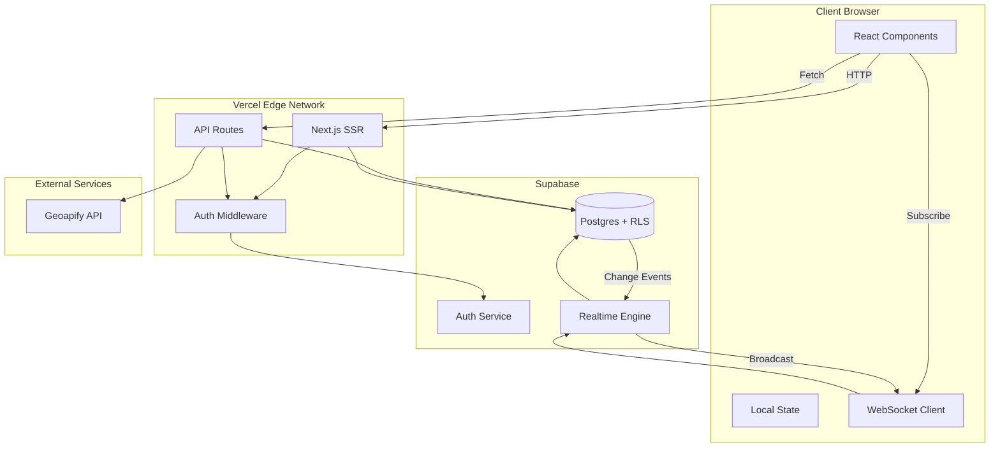
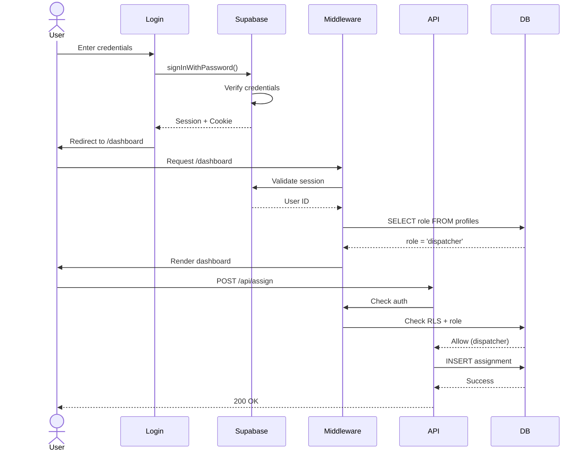
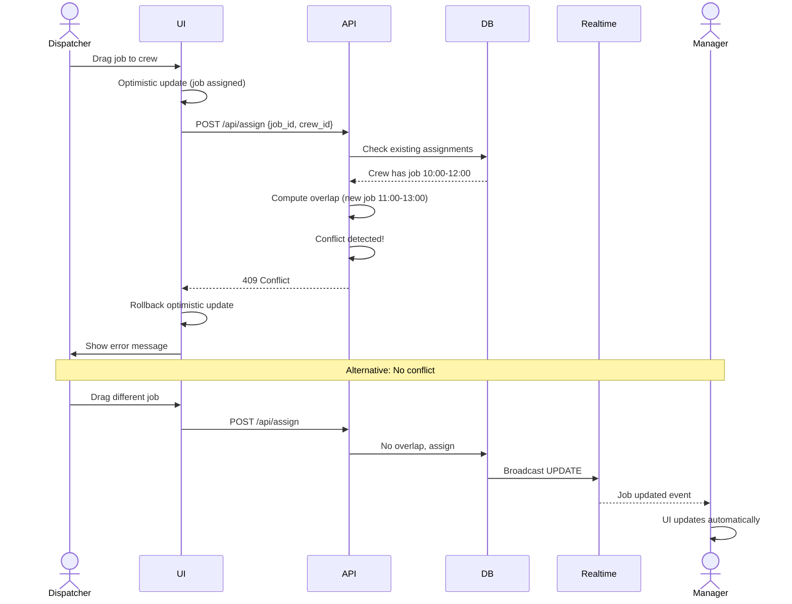
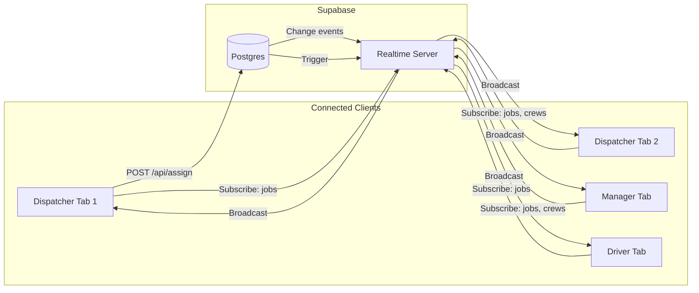
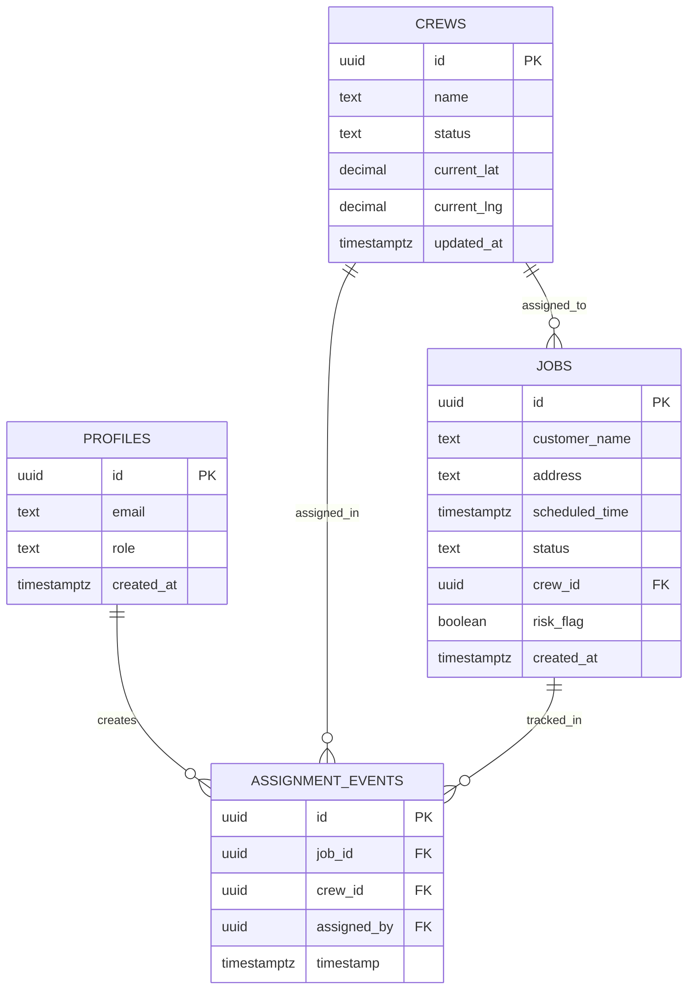
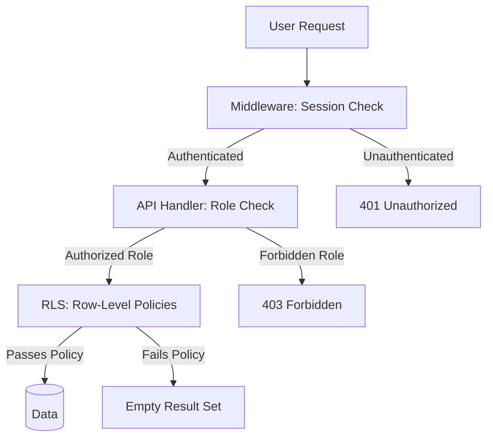
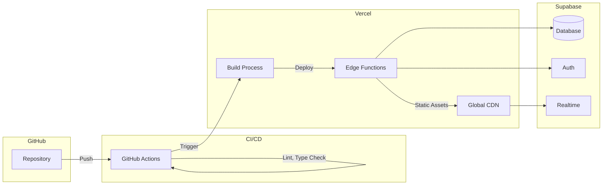

# Move Ready Plus - Architecture Documentation

## System Overview

Move Ready Plus is a real-time operations dashboard built on Vercel and Supabase, designed to coordinate moving crews without custom backend infrastructure.

---

## Architecture Diagram



---

## Authentication Flow



---

## Job Assignment Flow



---

## Realtime Architecture



### Subscription Channels

| Table | Events | Subscribers |
|-------|--------|-------------|
| jobs | INSERT, UPDATE, DELETE | Dispatchers, Managers, Drivers (filtered by RLS) |
| crews | UPDATE | Dispatchers, Managers |
| assignment_events | INSERT | Dispatchers, Managers |

---

## Data Model



---

## RLS Policy Structure

### Jobs Table

| Operation | Role | Policy |
|-----------|------|--------|
| SELECT | Dispatcher, Manager | All rows |
| SELECT | Driver | Only `crew_id` matches driver's crew |
| INSERT | Dispatcher | All |
| UPDATE | Dispatcher | All |
| UPDATE | Driver | Only assigned jobs, status field only |
| DELETE | None | Forbidden |

### Crews Table

| Operation | Role | Policy |
|-----------|------|--------|
| SELECT | All authenticated | All rows |
| UPDATE | Dispatcher | All crews |
| UPDATE | Driver | Own crew only (location updates) |

### Profiles Table

| Operation | Role | Policy |
|-----------|------|--------|
| SELECT | Authenticated | Own profile only |
| INSERT/UPDATE/DELETE | Service role | All (managed server-side) |

---

## API Design Patterns

### Standard Response Format

**Success:**
```json
{
  "job": { /* resource */ },
  "jobs": [ /* array */ ]
}
```

**Error:**
```json
{
  "error": "Human-readable message",
  "conflicting_job": { /* optional context */ }
}
```

### Error Codes

- `401`: Not authenticated (missing/invalid session)
- `403`: Forbidden (insufficient role permissions)
- `404`: Resource not found
- `409`: Conflict (double-booking, race condition)
- `500`: Internal server error

### RBAC Pattern

All API routes follow:

```typescript
// 1. Validate session
const { data: { user } } = await supabase.auth.getUser();
if (!user) return 401;

// 2. Fetch role
const { data: profile } = await supabase
  .from('profiles')
  .select('role')
  .eq('id', user.id)
  .single();

// 3. Check permissions
if (profile.role !== 'dispatcher') return 403;

// 4. Perform operation (RLS enforces again at DB level)
const { data } = await supabase.from('jobs')...
```

---

## Client-Side State Management

### Strategy

**Local state** (React useState) for:
- UI-only state (drag state, modals, forms)
- Optimistic updates (immediately reflected, rolled back on error)

**Realtime sync** for:
- Jobs, crews, assignment events
- Location updates
- Status changes

**No global state library** (Redux, Zustand) - server state synced via Realtime eliminates need.

### Optimistic UI Pattern

```typescript
// 1. Store previous state
const previous = [...state];

// 2. Apply optimistic update
setState(optimisticValue);

// 3. Make API call
const response = await fetch('/api/...');

// 4. Rollback on error
if (!response.ok) {
  setState(previous);
  showError();
}
```

---

## Performance Optimizations

### Database

- **Indexes:** All foreign keys and frequently queried columns
- **RLS:** Policies use indexed columns (user_id, role, crew_id)
- **Triggers:** Minimal (only updated_at timestamp)

### Frontend

- **Code splitting:** Dynamic imports for Leaflet (large library)
- **Virtualization:** Tables > 50 rows use `@tanstack/react-virtual`
- **Caching:** Geoapify ETA cached 5 minutes per route
- **Debouncing:** Location updates debounced client-side (if implemented)

### API

- **Parallel queries:** Use `Promise.all` for independent fetches
- **Early returns:** Fail fast on validation errors
- **Connection pooling:** Supabase handles automatically

---

## Failure Modes & Mitigations

### Realtime Disconnect

**Detection:**
- Subscribe callback checks status: `CHANNEL_ERROR`, `TIMED_OUT`

**Mitigation:**
- Display degraded mode banner
- Fallback to 15-second polling via `use-poll-fallback`

**Recovery:**
- Automatic reconnection when network restored
- Banner disappears, polling stops

### Double Assignment Race

**Scenario:**
- Two dispatchers assign same job simultaneously

**Prevention:**
- API checks `job.crew_id IS NULL` before assignment
- Conflict query checks overlapping time windows
- First write wins, second gets 409

**Recovery:**
- Optimistic update rolls back
- Error message displayed
- User retries manually

### Geoapify Rate Limit

**Detection:**
- HTTP 429 response from API

**Mitigation:**
- 5-minute cache prevents repeated requests
- Fallback: Display "ETA unavailable"
- Retry with exponential backoff (future enhancement)

### Unauthorized Access

**Prevention:**
- RLS policies enforce at database level
- Middleware blocks unauthenticated requests
- API handlers check role before operations

**Logging:**
- RLS violations logged in Supabase logs
- Client errors logged to `error_logs` table

---

## Scalability Considerations

### Current Limits (Free Tier)

- **Supabase:**
  - 500 MB database (~50,000 jobs)
  - 2 GB bandwidth/month
  - 200 concurrent Realtime connections

- **Vercel:**
  - 100 GB bandwidth/month
  - 100 hours function execution/month
  - 6,000 function invocations/day

- **Geoapify:**
  - 3,000 API requests/day

### Growth Path

When exceeding free tier:

1. **Database:** Supabase Pro ($25/mo) → 8 GB database
2. **Bandwidth:** Vercel Pro ($20/mo) → 1 TB bandwidth
3. **ETA:** Geoapify paid tier or self-hosted routing (OSRM)
4. **Caching:** Add Redis for ETA caching (reduce Geoapify calls)

### Performance at Scale

Current implementation handles:
- **10 crews** easily
- **100 active jobs** without virtualization
- **1,000+ jobs** with virtualization enabled
- **50 concurrent users** (Realtime connections)

---

## Security Architecture

### Defense Layers



### Principle: Defense in Depth

1. **Middleware:** Blocks unauthenticated requests
2. **API Handler:** Checks role permissions
3. **RLS:** Enforces row-level access at database

Even if middleware is bypassed, RLS prevents data leaks.

---

## Monitoring & Observability

### Error Tracking

**Client Errors:**
- Captured by ErrorBoundary component
- Logged to `error_logs` table
- Includes user_id, stack trace, context

**Server Errors:**
- Logged to Vercel function logs
- Structured JSON format
- Includes timestamp, error, context

**Database Errors:**
- Supabase Dashboard → Logs
- RLS violations visible
- Query performance metrics

### Performance Monitoring

**Frontend:**
- Lighthouse audits (CI/CD)
- Vercel Analytics (optional, paid)
- Custom timing logs for table renders

**Backend:**
- Supabase Query Performance dashboard
- Slow query detection
- Connection pool monitoring

**Realtime:**
- Connection status tracking (RealtimeStatus component)
- Latency measurement (client-side)
- Fallback activation alerts

---

## Deployment Architecture



---

## Code Organization Principles

### Separation of Concerns

| Layer | Responsibility | Location |
|-------|---------------|----------|
| Presentation | UI components, styling | `components/` |
| Business Logic | API handlers, validation | `app/api/` |
| Data Access | Supabase queries | API routes |
| Auth | Session management, role checks | `middleware.ts`, `lib/supabase/server.ts` |
| Types | Domain models | `types/domain.ts` |
| Utilities | Helpers, formatting | `lib/utils.ts`, `lib/geoapify.ts` |

### File Naming Conventions

- **Components:** kebab-case (`dispatch-board.tsx`)
- **Types:** singular (`domain.ts`, not `domains.ts`)
- **API routes:** RESTful (`/api/jobs/[id]/route.ts`)
- **Hooks:** prefix with `use-` (`use-realtime.ts`)

---

## Design Decisions & Trade-offs

### 1. Option B (Profiles Table) for Roles

**Chosen:** Fetch role from `public.profiles` on each request

**Why:**
- Simpler than JWT custom claims
- Works on Supabase free tier (no Edge Functions)
- Role changes effective immediately
- Standard pattern in Supabase ecosystem

**Trade-off:**
- Extra DB query per authenticated request
- Negligible performance impact (< 5ms)

### 2. Optimistic UI Updates

**Chosen:** Update UI immediately, rollback on error

**Why:**
- Feels instant to users (< 50ms perceived latency)
- Handles 99% case (no conflicts) smoothly
- Graceful degradation on errors

**Trade-off:**
- Users see "flicker" on rollback
- Requires careful state management

### 3. 2-Hour Job Window

**Chosen:** Jobs occupy 2-hour blocks for overlap detection

**Why:**
- Typical moving job duration
- Simple conflict logic
- Buffer for delays

**Trade-off:**
- Not flexible for short jobs (< 2 hours)
- Could be made configurable per job type (future)

### 4. Supabase Realtime vs Custom WebSocket

**Chosen:** Supabase Realtime

**Why:**
- No custom backend infrastructure
- Built-in authentication
- Free tier sufficient for demo
- Automatic scaling

**Trade-off:**
- Limited to 200 concurrent connections (free tier)
- Less control over message format
- Latency ~1-2 seconds (acceptable for ops dashboard)

### 5. Geoapify vs Self-Hosted OSRM

**Chosen:** Geoapify API

**Why:**
- Zero infrastructure
- 3,000 requests/day sufficient for demo
- ETA + routing + geocoding in one service

**Trade-off:**
- Rate limits
- External dependency
- Cost scales with usage

---

## Testing Strategy

### Unit Tests (Future)

Focus on pure business logic:
- Conflict detection algorithm
- Risk flag calculation
- Date/time utilities

### Integration Tests (Future)

Focus on API contracts:
- Role-based access enforcement
- Assignment flow end-to-end
- Error handling

### Manual QA (Current)

Focus on user flows:
- Dispatcher assignment workflow
- Manager analytics review
- Driver status updates
- Realtime propagation

---

## Extensibility

### Adding New User Roles

1. Add role to `profiles.role` enum in migration
2. Create RLS policies for new role
3. Add role to `UserRole` type in `types/domain.ts`
4. Update API handlers to check new role
5. Add navigation items in Sidebar component

### Adding New Job Fields

1. Add column to `jobs` table via migration
2. Update `Job` interface in `types/domain.ts`
3. Update API request validation
4. Update UI components to display field

### Adding New Realtime Events

1. Enable table in Supabase Realtime replication
2. Subscribe in relevant component:
   ```typescript
   const channel = supabase.channel('table-changes')
     .on('postgres_changes', { table: 'table_name' }, handler)
     .subscribe();
   ```

---

## Operational Runbooks

### Incident: Realtime Down

1. Check Supabase status page
2. Verify degraded mode banner shows
3. Confirm polling fallback active (15s)
4. Monitor for recovery
5. Alert users if downtime > 5 minutes

### Incident: High Error Rate

1. Check Vercel function logs
2. Query `error_logs` table for patterns
3. Identify common error message
4. Deploy hotfix if critical
5. Rollback deployment if needed

### Incident: Assignment Conflicts Spiking

1. Check `assignment_events` for timing patterns
2. Verify conflict detection working correctly
3. Consider reducing job window from 2 hours
4. Investigate if UI rollback logic failing

---

## Future Enhancements

### Short Term

1. **Automated Risk Detection:** pg_cron to run `update_risk_flags()` every 5 minutes
2. **Job Notes:** Add notes field for drivers to report issues
3. **ETA Display:** Show estimated arrival time on dispatch board
4. **Filters:** Filter jobs by status, date range, crew

### Medium Term

1. **Notifications:** Email alerts for at-risk jobs
2. **Mobile PWA:** Add manifest.json, service worker for offline support
3. **Bulk Assignment:** Assign multiple jobs at once
4. **Crew Routing:** Optimize multi-job routes for single crew

### Long Term

1. **ML-Based Routing:** Predict optimal crew assignments
2. **Customer Portal:** Public-facing job status tracking
3. **SMS Integrations:** Notify customers of ETA updates
4. **Historical Analytics:** Crew performance trends, seasonal patterns

---

## Maintenance Procedures

### Weekly

- Review `error_logs` table for patterns
- Check Supabase database size (free tier: 500 MB)
- Verify no RLS policy violations in logs

### Monthly

- Rotate test user passwords
- Archive old completed jobs (> 90 days)
- Review Geoapify usage vs rate limits
- Update dependencies (`npm outdated`)

### Quarterly

- Security audit (credentials, RLS policies)
- Performance review (Lighthouse, query times)
- User feedback synthesis
- Roadmap prioritization

---

## Dependencies Rationale

| Package | Why | Alternative Considered |
|---------|-----|----------------------|
| `@supabase/ssr` | Server-side auth with cookies | `@supabase/auth-helpers-nextjs` (deprecated) |
| `@tanstack/react-virtual` | Efficient table virtualization | `react-window` (less maintained) |
| `leaflet` | Mature, feature-rich mapping | Mapbox (paid), Google Maps (expensive) |
| `date-fns` | Lightweight date utilities | Moment.js (heavy), Day.js (smaller but less features) |
| `lucide-react` | Modern, tree-shakeable icons | React Icons (larger bundle) |
| `zod` | Runtime validation | Yup (older), Joi (Node-focused) |

---

## Compliance & Standards

### Accessibility (WCAG 2.1 AA)

- Keyboard navigation: Tab order logical
- Focus indicators: Visible on all interactive elements
- Color contrast: 4.5:1 minimum
- ARIA labels: Present on icon-only buttons
- Semantic HTML: Proper heading hierarchy

### Browser Support

- Chrome 120+
- Firefox 121+
- Safari 17+
- Edge 120+

### Mobile Support

- Responsive design: 320px - 1920px
- Touch-friendly: 44x44px minimum tap targets
- No horizontal scroll
- Readable text sizes (16px minimum)

---

## Disaster Recovery

### Data Loss Prevention

- Supabase automatic backups (daily, free tier)
- Critical tables: jobs, crews, profiles
- `assignment_events` provides audit trail

### Rollback Procedures

1. **Vercel:** Promote previous deployment (instant)
2. **Database:** Restore from Supabase backup (manual, < 1 hour)
3. **Code:** Revert Git commit, redeploy

### Backup Strategy

- Database: Supabase automated backups (retained 7 days, free tier)
- Code: Git history on GitHub
- Env vars: Document in 1Password/LastPass (not in repo)

---

## Glossary

- **RLS:** Row Level Security (Postgres feature for row-based permissions)
- **Realtime:** Supabase WebSocket service for live updates
- **Optimistic UI:** Update UI before server confirms (rollback on error)
- **Vertical Slice:** End-to-end feature (UI + API + DB)
- **RBAC:** Role-Based Access Control
- **ETA:** Estimated Time of Arrival
- **Degraded Mode:** System operates with reduced functionality (e.g., polling vs WebSocket)

---

This architecture balances simplicity, scalability, and production-readiness while staying within free tier limits.
